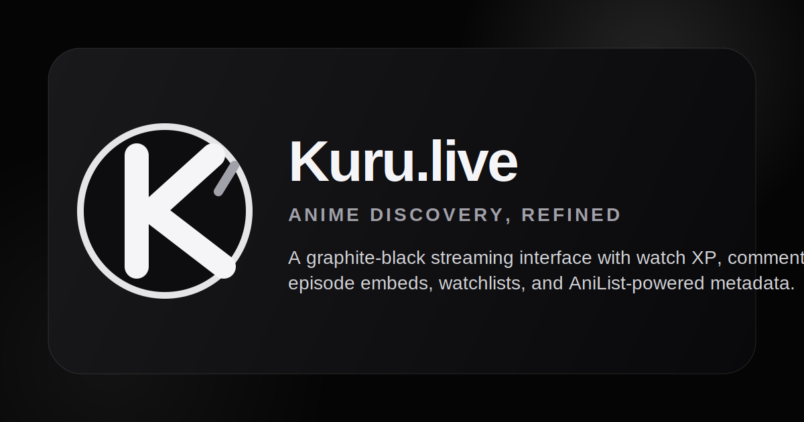
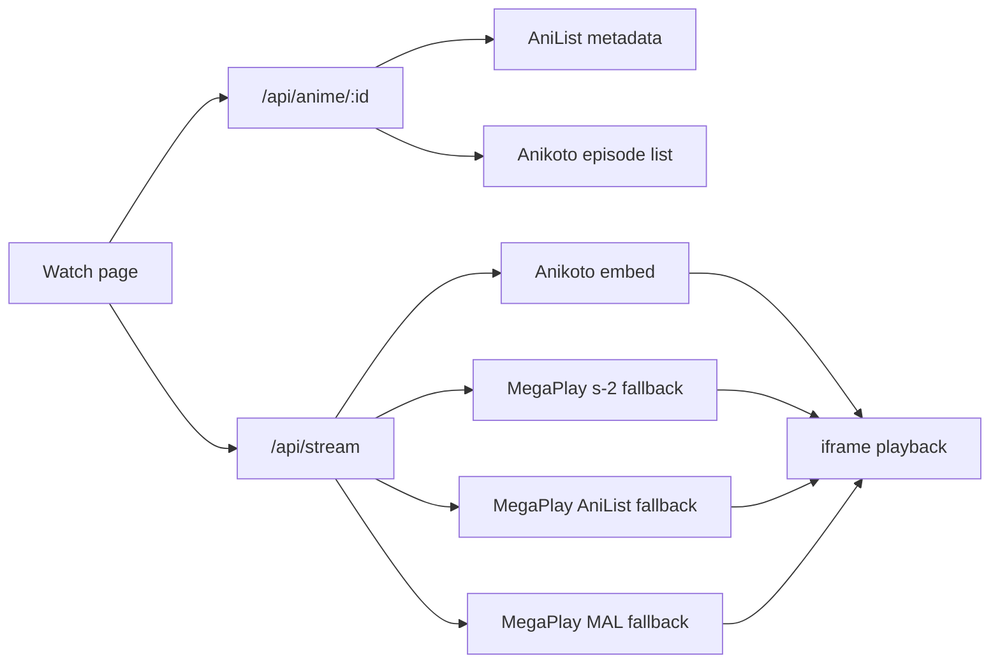

# Kuru.live

<p align="center">
  
</p>

<p align="center">
  <strong>Anime discovery, refined.</strong><br />
  A graphite-black anime platform for browsing titles, watching embedded episodes, tracking progress, collecting XP, and keeping a personal shelf.
</p>

<p align="center">
  
</p>

## Overview

Kuru.live is a cinematic anime discovery and watching interface built with Next.js App Router. The app uses AniList for rich anime metadata, Anikoto for episode availability, and MegaPlay-compatible HTTPS embeds for playback. User-facing progress features are available locally today, with a Supabase SQL migration included for production-ready profiles, comments, watch progress, XP, and row-level security.

## Highlights

- Apple-inspired black and graphite UI with a custom monochrome Kuru logo.
- Home, browse, genre, category, trending, new season, top anime, search, auth, profile, list, anime detail, and watch pages.
- AniList metadata enrichment for titles, posters, banners, genres, relations, characters, scores, trailers, and seasonal discovery.
- Embed-first playback flow with Anikoto episode matching, MegaPlay episode fallback, AniList direct embed fallback, and MAL direct embed fallback.
- Comments, likes, dislikes, watchlist, local watch history, and watched XP leveling.
- GSAP and Lenis-powered scroll polish, scroll-reactive marquee, magnetic buttons, reveal animations, and smooth mobile layouts.
- Supabase schema for persistent profiles, watchlists, episode progress, watched episodes, comments, reactions, XP events, triggers, and RLS policies.

## Product Images

| Logo | Product cover |
| --- | --- |
|  |  |

## Core Routes

| Route | Purpose |
| --- | --- |
| `/` | Hero, scroll-reactive marquee, continue watching, trending, seasonal, and top shelves |
| `/browse` | Full anime directory |
| `/trending` | Trending anime collection |
| `/new-season` | Current season anime |
| `/top-anime` | Highest-rated anime |
| `/genres`, `/genre/[genre]` | Genre discovery |
| `/categories`, `/category/[category]` | Format/status/category browsing |
| `/anime/[id]` | Anime details, episodes, comments, reactions, XP overview |
| `/watch/[id]/[episode]` | Embedded playback, episode list, mark watched, XP progress |
| `/my-list` | Watchlist and local watch history |
| `/profile` | Viewer profile, shelf stats, watched level progress |
| `/login`, `/signup`, `/forgot-password` | Auth UI surfaces |

## Embed Flow

Kuru.live does not store video files. The watch route asks the server resolver for a safe HTTPS playback target, then renders the returned embed in an iframe.



Resolver examples:

```ts
// Direct AniList-style embed
https://megaplay.buzz/stream/ani/{anilistId}/{episode}/sub

// Direct MAL-style embed
https://megaplay.buzz/stream/mal/{malId}/{episode}/sub

// Episode embed fallback
https://megaplay.buzz/stream/s-2/{episodeEmbedId}/sub
```

The resolver validates the embed host and skips unavailable embed pages before returning a playable target.

## SQL Showcase

The production persistence model lives in:

```txt
supabase/migrations/006_social_watch_xp.sql
```

Schema coverage:

- `profiles`: user display data, role, tier, XP, level, watch minutes, streaks, and profile counters.
- `anime_titles`: cached anime title records keyed by AniList ID.
- `watchlists`: user shelf state, progress, favorites, scores, and notes.
- `episode_progress`: per-episode playback position and completion state.
- `watch_sessions`: session-level viewing analytics.
- `watched_episodes`: deduplicated completed episode records.
- `episode_comments`: comments and threaded replies.
- `comment_reactions`: upvote/downvote reactions.
- `xp_events`: immutable XP ledger.

Example excerpt:

```sql
create table if not exists public.episode_comments (
  id uuid primary key default gen_random_uuid(),
  user_id uuid not null references public.profiles(id) on delete cascade,
  anime_id integer not null,
  episode_num integer check (episode_num is null or episode_num > 0),
  parent_id uuid references public.episode_comments(id) on delete cascade,
  body text not null check (char_length(body) between 1 and 2000),
  spoiler boolean not null default false,
  hidden boolean not null default false,
  upvotes integer not null default 0 check (upvotes >= 0),
  downvotes integer not null default 0 check (downvotes >= 0),
  created_at timestamptz not null default now(),
  updated_at timestamptz not null default now()
);
```

XP leveling function:

```sql
create or replace function public.kuru_level_for_xp(total_xp integer)
returns integer
language sql
immutable
as $$
  select least(99, greatest(1, floor(sqrt(greatest(total_xp, 0)::numeric / 100))::integer + 1));
$$;
```

Episode completion trigger path:

```sql
create trigger award_episode_progress_xp
before insert or update on public.episode_progress
for each row execute function public.after_episode_progress_upsert();
```

## Local Storage Features

Until Supabase auth is wired into the UI, the app persists demo user state in the browser:

- `kuro-auth`: local profile session.
- `kuro-watchlist`: saved anime shelf.
- `kuro_history`: recent watch history.
- `kuro_community`: comments and like/dislike state.
- `kuro_viewer_xp`: watched episode XP and level state.

## Tech Stack

- Next.js 14 App Router
- React 18
- TypeScript
- Tailwind CSS
- shadcn-style local UI primitives
- TanStack Query
- Zustand
- GSAP
- Lenis
- HLS.js
- Supabase SQL migration

## Environment

Create `.env.local`:

```dotenv
ANILIST_BASE_URL=https://graphql.anilist.co
MEGAPLAY_BASE_URL=https://megaplay.buzz
ANIKOTO_API_BASE=https://anikotoapi.site
NEXT_PUBLIC_SITE_URL=http://localhost:3000
```

Keep server-only values unprefixed. Use `NEXT_PUBLIC_` only for values that are safe to expose in the browser.

## Getting Started

```bash
npm install
npm run dev
```

Open:

```txt
http://localhost:3000
```

Production check:

```bash
npm run lint
npm run build
npm run start
```

## Project Structure

```txt
app/                    Next.js routes and API endpoints
components/             UI, layout, effects, cards, home sections, player, community panel
lib/                    AniList, embed resolver, watchmode, and utility helpers
public/                 Kuru logo and README cover
store/                  Zustand auth, watchlist, player, and UI state
supabase/migrations/    SQL schema, triggers, XP, comments, and RLS
```

## API Surface

| Endpoint | Purpose |
| --- | --- |
| `/api/anime` | Browse/search lists from AniList |
| `/api/anime/[id]` | Anime detail enrichment with Anikoto episode availability |
| `/api/stream` | Safe embed resolver for watch playback |

## Verification

The current cleanup/build pass was checked with:

```bash
npx tsc --noEmit
npm run lint
npm run build
```

## Notes

- The app uses embeds and does not host video files.
- The included SQL is ready for Supabase migration workflows.
- Demo social/XP features currently persist locally and are structured to map cleanly to the SQL tables later.
